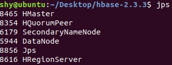
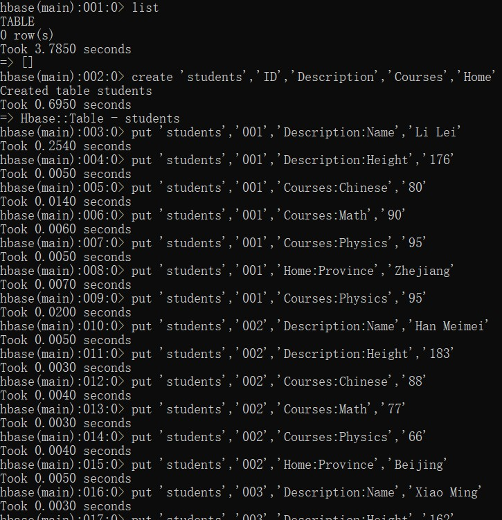
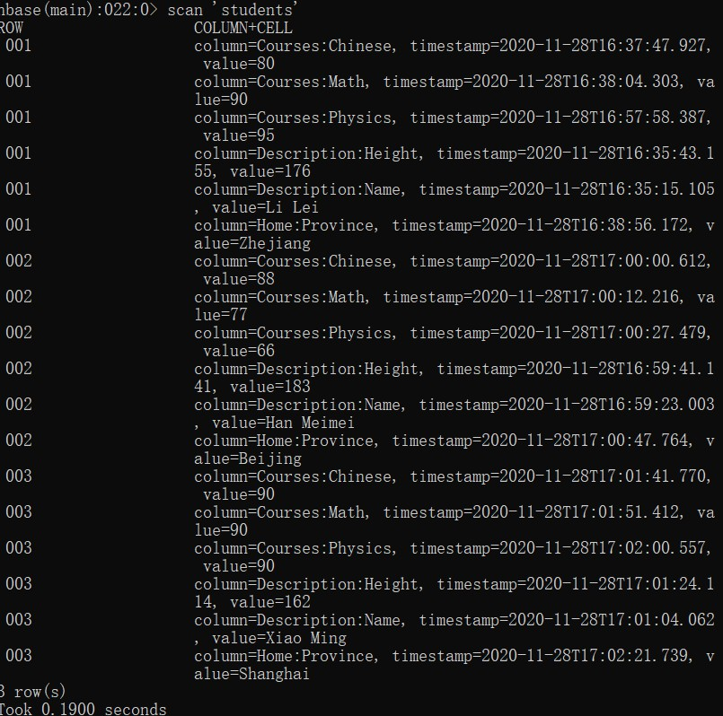
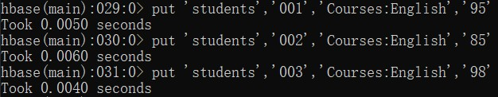
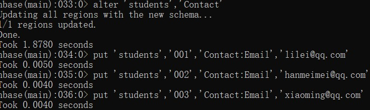
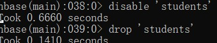
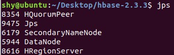
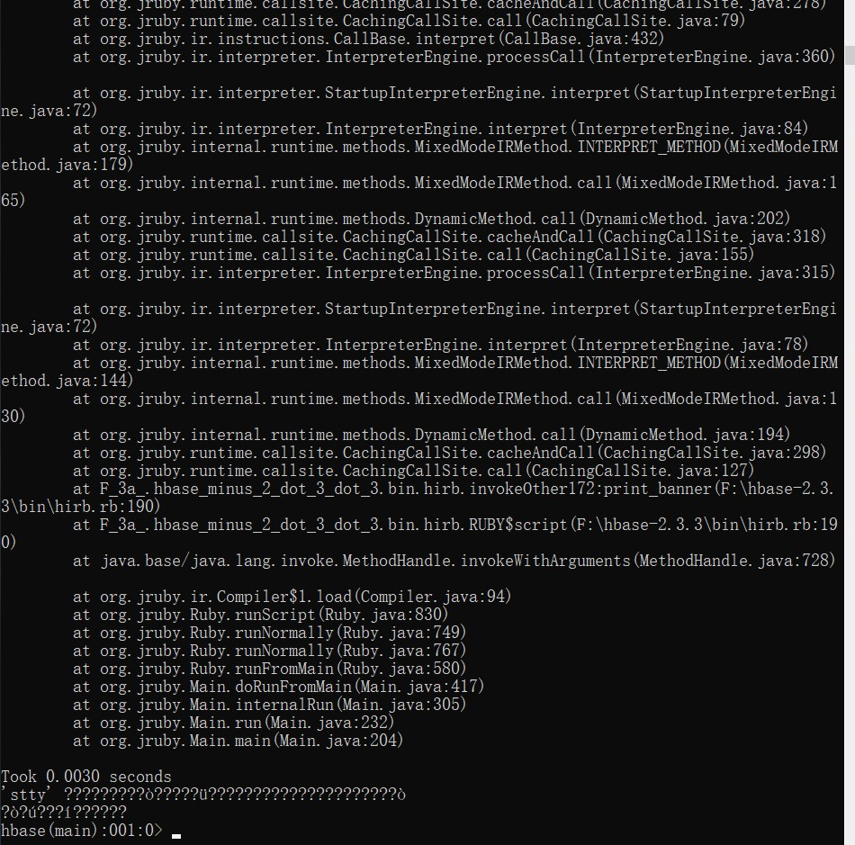
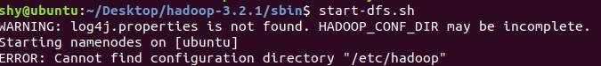
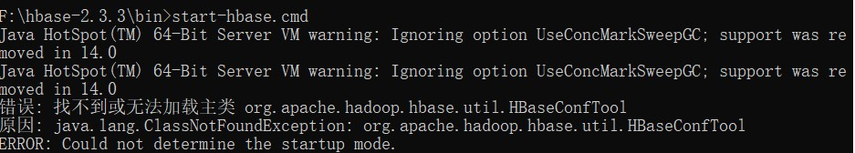

# 实验三

## 作业要求

1. 下载并安装HBase，尝试单机Standalone模式、伪分布式模式、集群模式（可选）。

2. 以伪分布式运行HBase，编写Java程序，完成下列任务：（1）创建讲义中的students表；（2）扫描创建后的students表；（3）查询学生来自的省；（4）增加新的列Courses:English，并添加数据；（5）增加新的列族Contact和新列Contact:Email，并添加数据；（6）删除students表。

3. 再用shell完成上述Java程序的任务。

4. 撰写实验报告，要求提交代码，记录步骤，给出运行截图。汇报在安装运行HBase过程中出现的问题，并给出解决方案（未出现问题则可免）。

## 设计思路

本实验涉及操作相对简单，步骤布置得很清晰。我将单机模式和伪分布式模式的环境搭建位置，分别安排在了windows上和ubuntu上，与hadoop相呼应。

## 实验结果

### ubuntu伪分布式

#### 伪分布式jps

### windows单机shell

以上是shell的运行结果，全部按照要求完成。

## 思考

遇到一些问题，以下逐一列出。

#### hbase消失事件

果然，前一秒还在的hbase，后一秒就不翼而飞了。

#### windows单机模式运行shell时的大型报错现场

这些错误多是与一些Java类相关的错误，貌似与hadoop的设置相关，但是虽然呈现出报错，即各种error，却不影响实际的shell运行。更像是warning。

#### ubuntu中一个旧错误：每次运行hadoop都报hadoop_conf_dir的错

这个错误这次终于得到了解决。这个错误与hadoop之类的全无关系，只是与虚拟机本身有关。

虚拟机在打开文件时会自动创建交换文件.swap，如果中途异常退出就会保留交换文件，后来每次都回打开这个交换文件。我之前一直没有了解过这一点。这次经过查找资料，终于把这个交换文件直接删掉了，这个报错就直接消失了，问题得到了解决。

#### 一个无法重现的windows运行start-hbase.cmd时的随机报错

这个错误我称之为随机报错，就像很久以前的实验中出现的docker的容器内dns解析失效一样，前一秒还好好的，后一秒就会抽风，报这个错。

在当时这个cmd窗口，会反复报这个错。但是退出cmd再打开cmd再执行这个命令，就不报错了。幸好在它报错时截图了。

#### windows的单机hbase的日志窗口的报错

说到windows的单机版hbase，我有一个小坑，刚开始踩了好多遍。在cmd中运行start-hbase.cmd后，会打开一个日志窗口。![](img/windows运行start-hbase时的连接报错.jpg我刚开始见到这些报错，总是原地等待，以为要在此窗口打开hbase shell。实际上只要把日志窗口放一边，在原cmd窗口打开hbase shell就行了。这些报错应该都是warning，不影响hbase shell的运行。